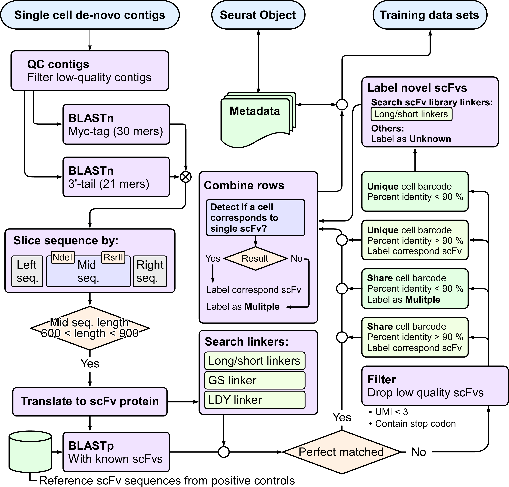

# scRepertoire-seq2corpus
This repository provides code to parse scRepertoire-seq data, integrate the outputs with a Seurat object, and generate language-based AI-trainable data for the **MatuRL** model (repository: https://github.com/Jyunyi-Chen/MatuRL) as described in "*AI-guided scFv engineering enhances T cell-specific cytotoxicity toward cancer cells*". The codebase is shared to enhance experimental transparency and to archive the analysis steps. It is not packaged as a command line interface or a reusable library at present, and such packaging may be considered in future updates.

## Flowchart

## Flowchart interpretation
1) Single-cell de novo contigs are generated and subjected to quality control to remove low-quality entries.
2) Structural features are verified by BLASTn against Myc-tag 30-mers and against 3'-tail 21-mers.
3) Sequences are partitioned into left, middle, and right segments using the NdeI and RsrII landmarks.
4) Contigs are retained when the middle segment length falls within 600 to 900 nt.
5) High-confidence contigs are translated to scFv protein sequences.
6) Translated products are compared to known scFvs by BLASTp to identify perfect or close matches.
7) In parallel, single-cell metadata are prepared in a Seurat object.
8) scFv annotations are mapped to cell barcodes and merged into the Seurat metadata.
9) Rows are combined per barcode to determine whether a cell corresponds to a single scFv. If yes, label as the corresponding scFv. If no, label as Multiple.
10) Linker motifs are queried to characterize novel scFvs, including long or short library linkers, GS linker, and LDY linker. Sequences without recognized linkers are labeled as Unknown.
11) Training data are stratified by barcode uniqueness and sequence identity:
    - Unique barcode with percent identity less than 90 percent, label as corresponding scFv.
    - Unique barcode with percent identity greater than 90 percent, label as corresponding scFv.
    - Shared barcode with percent identity less than 90 percent, label as Multiple.
    - Shared barcode with percent identity greater than 90 percent, label as corresponding scFv.
12) Low-quality scFvs are filtered to finalize the training-ready dataset.

## Method
Sequencing reads were processed with Cell Ranger v8.0.1 in VDJ mode with de novo assembly enabled (--denovo) and custom inner enrichment primers specified (--inner-enrichment-primers) to generate full-length contigs. The contigs then underwent multiple quality control steps, including filters on sequence quality, length, and the presence of expected structural features. Specifically, contigs were screened by BLAST alignment to Myc-tag and 3'-tail sequences, by length constraints, and by linker sequence identification. High-confidence contigs were translated into amino acid sequences. The resulting scFv information was mapped to the corresponding single-cell barcodes and integrated into the Seurat object metadata. The multimodal dataset, which combines transcriptomic and scFv sequence features at single-cell resolution, was then used to train deep learning models.

## Full scFvs data accessibility
Full scFvs data available upon request due to patent considerations. Please contact the corresponding author of this paper.

Chia-Wei Li, Institute of Biomedical Sciences, Academia Sinica, 128 Academia Rd., Sec. 2, Taipei 11529, Taiwan, Tel: +886-2-26523912. Fax: +886-2-27829224. Email: cwli@ibms.sinica.edu.tw.
